# TopMovie

 

## Tabla de contenido

1. [Introducción](#Introduccion)  
1.1. [URL de Acceso a la aplicación	](#URLAcceso)  
2.	[Lógica de la aplicación](#Logica)  
2.1.	[Página de inicio (index.html)](#index)    
2.2.	[Función “registro.php”](#registro)  
2.3.	[Función “login.php”](#login)  
2.4.	[Catálogo (catalogo.php)](#catalogo)  
2.5.	[Función “tablaPeliculas.php”](#tablaPeliculas)  
2.6.	[Información de película (película.php)](#pelicula)  
2.7.	[Función “valorar.php”](#valorar)  
2.8.	[Función “comentar.php”](#comentar)  
2.9.	[Información de usuario (usuario.php)](#usuario)  
2.10.	[Función “modificar_datos.php”](#modificar_datos)  
2.11.	[Recomendaciones (Recomendacion.php)](#Recomendacion)  
2.12.	[Formato y estilo](#formato)  
2.13.	[Funciones genéricas](#genericas)  
3.	[Diseño de la base de datos](#bbdd)  
4.	[Algoritmo, interfaz y funciones MATLAB](#algoritmo)  
5.	[Funcionalidades adicionales implementadas](#adicionales)  
5.1.	[Ordenación de catálogo por fecha de estreno](#ordenacion)  
5.2.	[Estadísticas de usuario](#estadisticas)  
5.3.	[Javascript & Ajax](#ajax)  
6.	[Framework: Foundation](#foundation)  
7.	[Anexos](#anexos)  
7.1.	[Anexo 1 – Listado de funciones php implementadas](#anexo1)  
7.2.	[Anexo 2 – Estructura organizativa de archivos](#anexo2)  
8.	[Referencias](#referencias)  

<a name="Introduccion"/>

### 1.	Introducción  

La aplicación “TopMovie” ha sido desarrollada con el fin de ofrecer al usuario un servicio de información sobre un catálogo de películas. La interacción del usuario con la aplicación generará al mismo tiempo una serie de recomendaciones basadas en el algoritmo de filtrado colaborativo a través de un sistema de votación, además de la posibilidad de escribir comentarios o críticas sobre la película en cuestión.  
El desarrollo de la lógica de aplicación podría resumirse en la utilización de funciones que tienen como finalidad ofrecer al usuario cada una de las necesidades requeridas para su correcto funcionamiento.   

<a name="URLAcceso"/>

### 1.1	URL de Acceso a la aplicación  

En primer lugar, la aplicación web está almacenada en el servidor del laboratorio de prácticas de la asignatura y el acceso a la aplicación se realiza a través del siguiente enlace:  
http://labit601.upct.es/~ai6/videoGMA  
  
<a name="Logica"/>

### 2.	Lógica de la aplicación

A continuación, se pasa a desarrollar en detalle cada una de las funcionalidades y a justificar la solución llevada a cabo.

<a name="index"/>

### 2.1	Página de inicio (index.html)

Al acceder a la aplicación web se muestra la página de inicio (index.html) en la que el usuario puede registrarse, si no lo ha hecho previamente, e iniciar sesión. El método de registro se ha llevado a cabo con un formulario en el que se recogen los datos de usuario y que a través del método “POST” son pasados a “registro.php” y preparados para ser insertados en la base de datos. El método de inicio de sesión se realiza a través de “login.php” mediante cookies con una duración determinada de 1800 segundos.

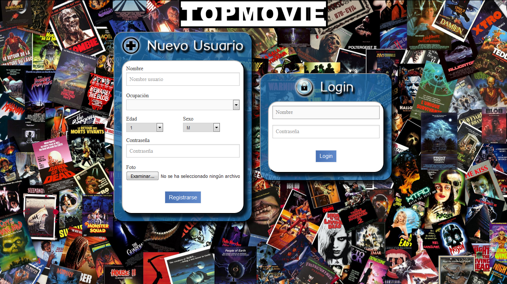 

<a name="registro"/>  

### 2.2	Función “registro.php”  

En esta función se establece la conexión a la base de datos y se recogen los datos de $_POST para su posterior inserción en la base de datos.  

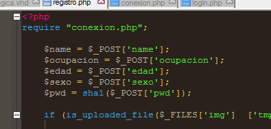 
   
Cabe destacar que se utiliza la función is_uploaded_file() para comprobar si el formulario de registro ha guardado correctamente la imagen de usuario para que posteriormente sea movida a la carpeta creada en el directorio con el nombre de “/img”.  
  
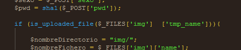   
  
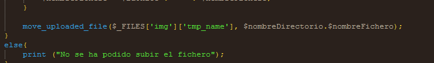   
   
Los permisos de la carpeta /img han tenido que ser modificados para que se pudiera guardar la imagen asociada a cada usuario añadiendo permisos de escritura para todos los usuarios.  

  
<a name="login"/>  

### 2.3	Función “login.php”  

Esta otra función básicamente se resume en comprobar si los datos que se han introducido y son guardados en una cookie concuerdan con alguno de los usuarios de la base de datos y así dar acceso a la vista del catálogo.  
  
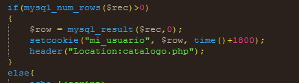   
   
<a name="catalogo"/>  

### 2.4	Catálogo (catalogo.php)  
  
Una vez se realiza el inicio de sesión, se accede a la vista “catalogo.php” donde se muestra información de cada una de las películas en una tabla con posibilidad de ordenarla: por defecto, por orden alfabético, por fecha de estreno o por puntuación ponderada. La tabla muestra hasta 10 películas por página con la posibilidad de navegar entre ellas con dos botones de control en la parte inferior.    
  
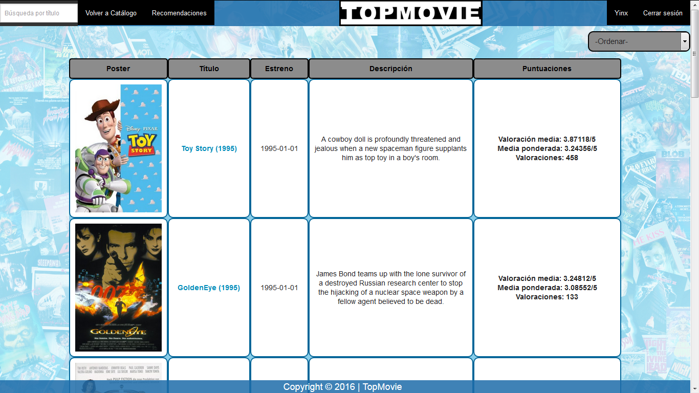     
    
En primer lugar comprueba si el límite de tiempo marcado en la cookie ha sido sobrepasado y manda un mensaje de alerta si es así obligando al usuario a introducir nuevamente sus credenciales. A continuación muestra la tabla ordenada “por defecto” a través de peticionAjax.js con la función “enviar()” en la que se le pasan como parámetros el tipo de ordenación que seguirá la tabla y la página en la que se encuentra para facilitar la navegación entre ellas con los dos botones inferiores.  
   
<a name="tablaPeliculas"/>  

### 2.5	Función “tablaPeliculas.php”  

Esta función es llamada desde peticionAjax.js con un filtro determinado con el que ordenará la tabla y la página en la que se encuentra.
  
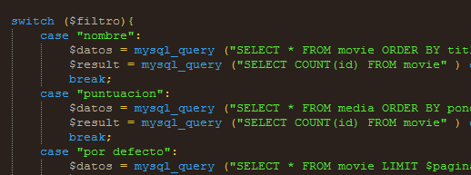   
   
Su funcionamiento se basa en realizar las consultas oportunas para ordenar y mostrar la tabla según la opción seleccionada. El código común ha sido eliminado de los filtros “case” realizándolo posteriormente igual para cualquier tipo de ordenación. Esta porción de código en concreto realiza las consultas a la base de datos oportunas para obtener para cada película su media, el total de votos y la media ponderada de la forma que se muestra a continuación.  
  
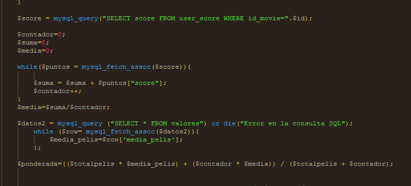   
  
Cabe destacar que en la visualización de la tabla se ha optado por reducir el tiempo de respuesta en el cálculo de la media total de las películas del catálogo, necesario para calcular la media ponderada, con la inserción de una nueva tabla en la base de datos que posteriormente será explicada. De este modo la visualización será instantánea sin olvidar que esta media total de películas cambiará con cada nuevo voto.  
  
<a name="pelicula"/>  

### 2.6	Información de película (película.php)  

Una vez es seleccionada una película se accede a la vista “película.php” y se muestra información detallada con el título, fecha de estreno, enlace a IMDB, puntuaciones generales además de ofrecer la posibilidad de puntuar, comentar y visualizar todos los comentarios sobre la película.  
  
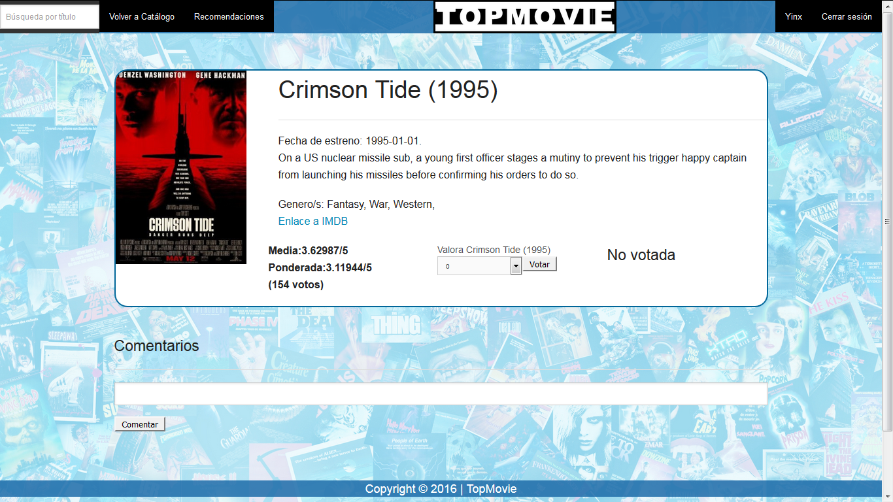   
  
<a name="valorar"/>  

### 2.7	Función “valorar.php”  

Como se ha comentado anteriormente, una vez se realiza la valoración de la película se deberá establecer un nuevo valor como media total de las películas además de actualizar el valor medio y ponderado de la película votada. De esta manera, cada vez que el usuario vota, en segundo plano se actualizan los datos de la media de la película y la media total de las películas, que se considera necesario para tener una media ponderada actualizada y real en cada visualización.  
  
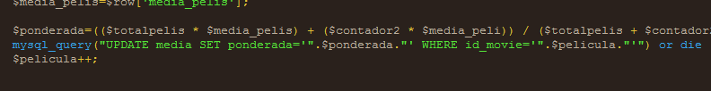   
  
<a name="comentar"/>   

### 2.8	Función “comentar.php”   
  
Sencillamente la función recoge los datos del formulario y los inserta en la base de datos.   
  
<a name="usuario"/>  

### 2.9	Información de usuario (usuario.php)  

Se accede desde la sección de cabecera en la parte superior derecha y muestra en primer lugar los datos de usuario junto con imagen de perfil y ofrece la posibilidad de modificar los datos personales y la contraseña. En segundo lugar muestra una serie de estadísticas para que sirvan de valoración ya que se entiende que el usuario puede cambiar de opinión respecto a una película y de esta forma tendría una visión global de todas las películas comentadas y votadas y poder modificar una votación realizada o insertar nuevos comentarios. Por último se ofrece la posibilidad de generar una lista personalizada de recomendaciones, tal y como se describe en el apartado 2.5.
   
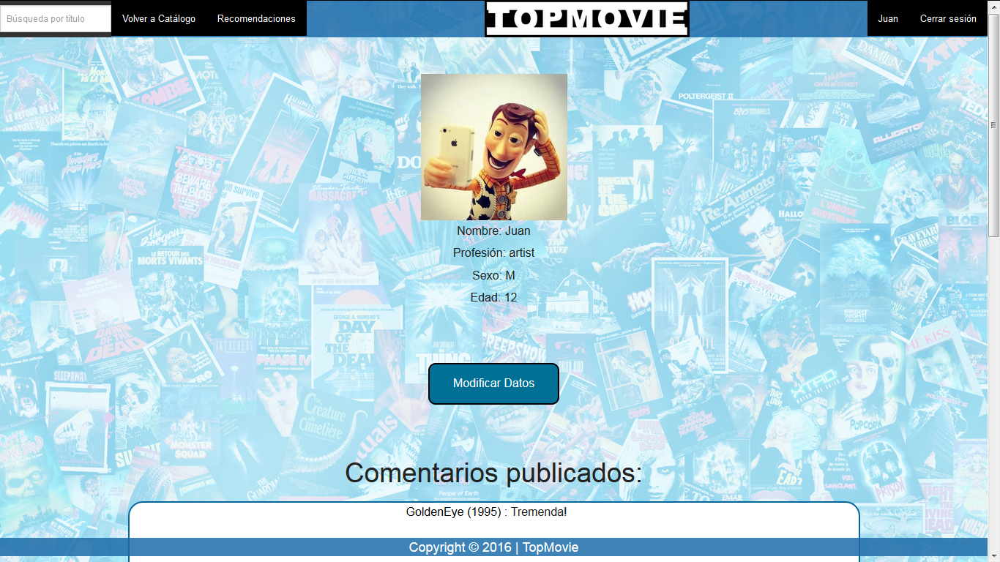   
  
<a name="modificar_datos"/>   

### 2.10	Función “modificar_datos.php”  

Con los valores insertados se actualiza la base de datos.  
  
<a name="Recomendacion"/>  

### 2.11	Recomendaciones (Recomendacion.php)  

Se accede desde la sección de cabecera y muestra una tabla con la información de las 10 películas con mejor puntuación que genera el algoritmo de filtrado colaborativo teniendo en cuenta los intereses del usuario y de perfiles de usuario similares. Para generar las recomendaciones se debe accionar un botón que se encuentra en la parte superior de la pantalla y el algoritmo se pondrá a trabajar en segundo plano en el servidor para que, pasado un tiempo de procesado en el que el usuario puede seguir navegando por la web, se muestre en este apartado una nueva recomendación personalizada.  
  
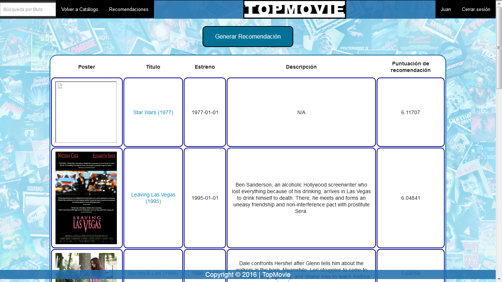   
   
<a name="formato"/>   

### 2.12	Formato y estilo  

Una vez la lógica de la aplicación ha sido completada se pasa a dar formato y estilo a cada “vista” o sección. Cada sección tiene en común con el resto los apartados de cabecera y pie de página. Se utiliza el framework “Foundation” como se detallará posteriormente ya que realiza un buen trabajo con clases CSS, por su facilidad de uso y porque el aspecto final de la aplicación web además de su adaptabilidad resulta notable.   

Además del framework se utilizan diversas hojas de estilo CSS para cada sección donde era necesario cambiar un elemento en cuestión por estética y adaptabilidad con el resto de elementos.  
  
<a name="genericas"/>   

### 2.13	Funciones genéricas   
  
En cada sección se han utilizado funciones genéricas que facilitaban la implementación de secciones como la de cabecera y pie de página en cada una de ellas. Además se ha realizado la función genérica encargada de conectar a la base de datos.   
  
Por otro lado se utilizan las hojas de estilo CSS comunes para una vista estándar de cada elemento además de las funciones Javascript.
    
<a name="bbdd"/> 

### 3.	Diseño de la base de datos  

Partiendo de la estructura inicial de la base de datos se llevan a cabo una serie de modificaciones.   

La primera es la inserción de una nueva tabla llamada “media” que tiene como finalidad ofrecer simplicidad a la hora de ordenar por puntuación ponderada las películas. La tabla quedaría de la siguiente forma:  
  
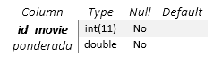   
  
En segundo lugar se añade otra nueva tabla denominada “valores” que se encarga de almacenar un valor medio de todas las películas en base a los cálculos que afectan a la media total de películas que cambia cada vez que un usuario añade un nuevo voto sobre una película y modifica su valor. Otros dos valores que almacena son “id_user”, para ser utilizado como clave primaria, y un valor “time” de tipo TIMESTAMP que tiene la finalidad de guardar la última modificación sobre el valor medio del total de películas y de esta manera simplificar la visualización de los valores de puntuación sin tener que recalcular este valor. La tabla sería así:  
  
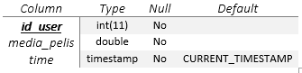   
  
De esta manera con cada votación, se produce en segundo plano un cambio de valores que afectan a la media ponderada de cada película. De este modo, esta última tabla almacenará una única fila con un valor medio del total de las películas atendiendo a un valor temporal. Si cuando se realiza la votación, existe un valor temporal anterior es eliminado y es insertado un nuevo valor medio para que así, en cada visualización se pueda mostrar el valor actualizado sin tiempo de espera para su cálculo.  
  
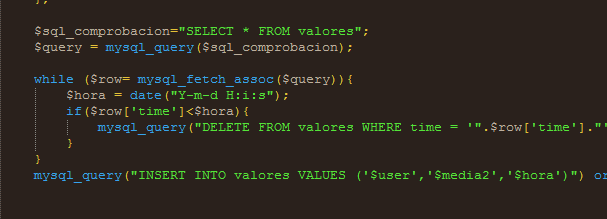 
   
<a name="algoritmo"/>  

### 4.	Algoritmo, interfaz y funciones MATLAB  

El algoritmo encargado de generar recomendaciones es el de filtrado colaborativo a través de los dos archivos getData() y updateRecommendation() situados en la carpeta /matlab del directorio web. Una vez se pulsa sobre el botón “Generar recomendación” se llama a la función dorec.php, que manda ejecutar el fichero recommendation() pasándole como argumento el identificador del usuario. Una vez es ejecutado, la sección de Recomendación mostrará una lista de 10 películas recomendadas según este algoritmo. Cabe mencionar que el algoritmo se ejecuta en segundo plano con las siguientes líneas de código, por lo que mientras se podrá navegar por el resto de la web, pero la recomendación no resulta instantánea.  
  
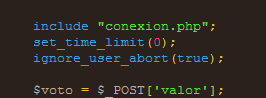   
   
<a name="adicionales"/>   

### 5.	Funcionalidades adicionales implementadas   
   
<a name="ordenacion"/>  

### 5.1	Ordenación de catálogo por fecha de estreno   

Una de las funcionalidades extra es la de ordenación por fecha de estreno implementada en el case de tablaPeliculas.php de la siguiente forma:  
  
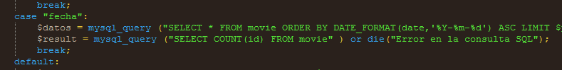   
  
<a name="estadisticas"/>   

### 5.2	Estadísticas de usuario   

Otra de las funcionalidades extra implementadas es el de la muestra de una serie de estadísticas en la sección “usuario” tales como los comentarios publicados, las puntuaciones publicadas y las recomendaciones.   
    
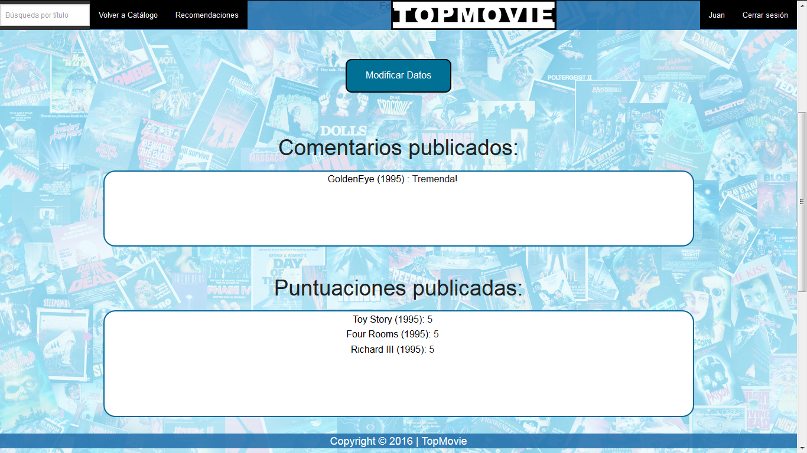   
   
   
   
<a name="ajax"/>  

### 5.3	Javascript & Ajax  

Ajax ha servido para mostrar dinámicamente la tabla según su ordenación y su utilización ha facilitado a la hora de ir navegando por el catálogo en páginas con la función enviar().  
  
El buscador también parte de Ajax. De esta manera se obtiene un resultado de búsqueda con un dropdown conforme se va escribiendo caracteres mediante la función buscar(). Para la realización de este apartado se ha tenido que consultar referencias que aparecen descritas en el apartado 8.  
  
<a name="foundation"/>   

### 6.	Framework: Foundation  
  
La utilización de un marco predefinido ayuda a tener una base estética y estructural del layout, por ello la utilización front-end de “Foundation” en este proyecto está orientado sobre todo a solucionar los problemas ante la utilización y vista del usuario. Además es solución ante los problemas de incompatibilidad del navegador y así, de este modo, la lógica no se ve empañada por una mala experiencia de usuario en la navegación. No se ha exprimido todas las capacidades que aporta el framework pero cumple con los requisitos que se han considerado necesarios para la correcta ejecución de la aplicación, además de solucionar el problema del estilo y formato de la página con hojas de estilo CSS aplicando un modelo común.  
  
   
  
<a name="anexos"/>   

### 7.	Anexos  
  
<a name="anexo1"/>  

### 7.1	Anexo 1 – Listado de funciones php implementadas  

buscar.php
cabecera.php
catalogo.php
cerrar_sesion.php
comentar.php
conexión.php
dorec.php
login.php
modificar_datos.php
película.php
pie.php
Recomendación.php
registro.php
tablaPeliculas.php
update_user.php
usuario.php
valorar.php
  
<a name="anexo2"/>   

### 7.2	Anexo 2 – Estructura organizativa de archivos  
  
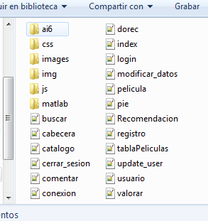   
  
/ai6 – Directorio donde se aloja el conector mysql-connector-java-5.1.38-bin.  
/css – Directorio donde se alojan las distintas hojas de estilo y la carpeta donde se guardan las imágenes de fondo.  
/images – Directorio donde se alojan las distintas portadas de películas.  
/img – Directorio donde se guardan las distintas imágenes de los usuarios.  
/js – Directorio donde se almacenan los distintos archivos Javascript.  
/matlab – Directorio donde se alojan los distintos ficheros Matlab necesarios para la ejecución del algoritmo de recomendación.  
  
<a name="referencias"/>   

### 8.	Referencias   
  
Funcionamiento de PHP - http://php.net/manual/es/  
Elección del framework – https://carlosazaustre.es/blog/frameworks-de-javascript/  
Utilización de Foundation - http://cubemedia.co/responsive-instalando-foundation-css/  
Buscador onkeyup - http://www.w3schools.com/ajax/ajax_php.asp  
Dropdown en Foundation  - http://foundation.zurb.com/sites/docs/v/5.5.3/components/dropdown.html  
Frameworks - http://www.awwwards.com/what-are-frameworks-22-best-responsive-css-frameworks-for-web-design.html  
